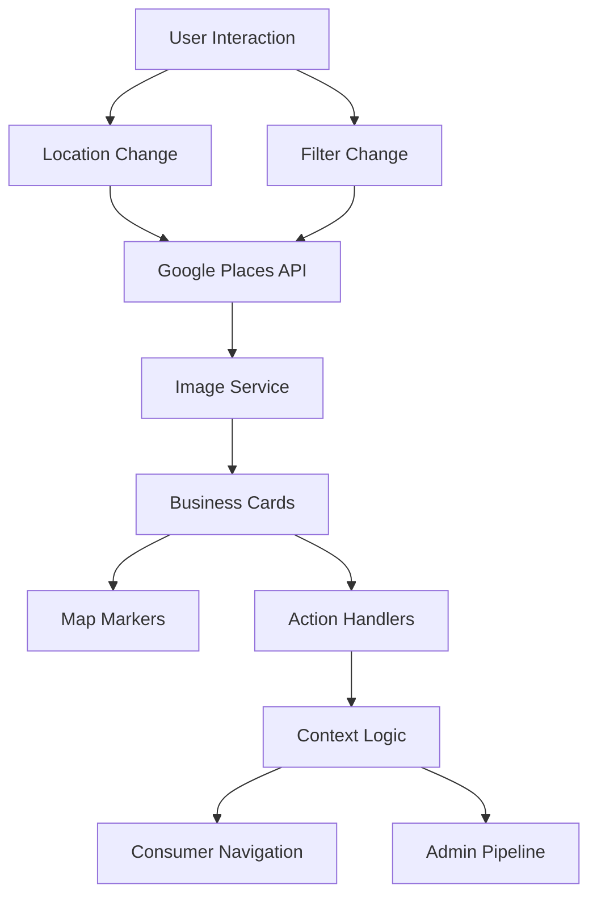

# MapSearchModule - Unified Map-Based Discovery System

> [2025-01-07 12:10 UTC] - Comprehensive documentation for the unified map-based business discovery module

## 🎯 Overview

The `MapSearchModule` is a powerful, reusable React component that provides map-based business discovery functionality for both **consumer-facing** and **admin dashboard** contexts. It unifies Google Places API integration, interactive mapping, filtering, and context-aware business cards into a single, flexible module.

## ✨ Key Features

- 🗺️ **Interactive Google Maps** with pin dropping and radius selection
- 🎛️ **Context-aware interface** (consumer vs admin)
- 🔍 **Real-time Google Places search** with live data
- 📱 **Responsive design** (mobile-first for consumers, dashboard for admin)
- 🏷️ **Smart filtering** (cuisine, price, rating, status)
- 🎨 **Visual business cards** with context-specific actions
- 🔄 **Automatic deduplication** by Google Place ID
- 📊 **Admin pipeline management** (approve/reject/lead generation)

## 🏗️ Architecture

```
📁 src/components/MapSearchModule/
├── 📄 types.ts              # TypeScript interfaces and types
├── 📄 config.ts             # Context-specific configurations
├── 📄 BusinessCard.tsx      # Adaptive business card component
├── 📄 index.tsx             # Main MapSearchModule component
├── 📁 examples/
│   ├── 📄 ConsumerExample.tsx
│   └── 📄 AdminExample.tsx
└── 📄 README.md             # This documentation
```

## 🚀 Quick Start

### Consumer Context (Restaurants Page)

```tsx
import MapSearchModule from '@/components/MapSearchModule';

<MapSearchModule
  context="consumer"
  resultCardType="restaurant"
  actions={['view', 'call', 'directions', 'book', 'menu']}
  filtersEnabled={true}
  radiusSlider={true}
  showMap={true}
  cardLayout="grid"
  onBusinessAction={handleBusinessAction}
/>
```

### Admin Context (Business Discovery)

```tsx
import MapSearchModule from '@/components/MapSearchModule';

<MapSearchModule
  context="admin"
  resultCardType="restaurant"
  actions={['approve', 'reject', 'lead', 'details']}
  cardLayout="list"
  mapHeight="400px"
  maxResults={50}
  onApprove={handleApprove}
  onReject={handleReject}
  onCreateLead={handleCreateLead}
/>
```

## 📋 Props Reference

### Core Props

| Prop | Type | Default | Description |
|------|------|---------|-------------|
| `context` | `'consumer' \| 'admin'` | **Required** | Determines UI and functionality context |
| `resultCardType` | `'restaurant' \| 'business' \| 'hotel' \| 'spa'` | `'restaurant'` | Type of businesses to search for |
| `actions` | `BusinessCardAction[]` | Context default | Available actions on business cards |

### Display Options

| Prop | Type | Default | Description |
|------|------|---------|-------------|
| `filtersEnabled` | `boolean` | `true` | Show filter controls |
| `radiusSlider` | `boolean` | `true` | Show radius adjustment slider |
| `showMap` | `boolean` | `true` | Display interactive map |
| `cardLayout` | `'grid' \| 'list'` | Context default | Business card layout style |
| `mapHeight` | `string` | Context default | CSS height for map container |

### Event Handlers

| Prop | Type | Description |
|------|------|-------------|
| `onBusinessAction` | `(action, business) => void` | Handle business card actions |
| `onBusinessSelect` | `(business) => void` | Handle business selection |
| `onLocationChange` | `(location) => void` | Handle location changes |
| `onFiltersChange` | `(filters) => void` | Handle filter changes |

### Admin-Specific Props

| Prop | Type | Description |
|------|------|-------------|
| `onApprove` | `(business) => void` | Handle business approval |
| `onReject` | `(business) => void` | Handle business rejection |
| `onCreateLead` | `(business) => void` | Handle lead generation |

## 🎨 Context Configurations

### Consumer Context
- **Layout**: Grid cards with hero images
- **Actions**: View, Call, Directions, Book, Menu
- **Filters**: Cuisine, Price, Rating, Open Now
- **Map**: 300px height, consumer-friendly markers
- **Max Results**: 20 businesses

### Admin Context
- **Layout**: List cards with thumbnails
- **Actions**: Approve, Reject, Lead, Details
- **Filters**: Business Type, Status, Rating
- **Map**: 400px height, admin markers
- **Max Results**: 50 businesses

## 🔧 Business Card Actions

### Consumer Actions
- **`view`** - Navigate to business detail page
- **`call`** - Initiate phone call
- **`directions`** - Open Google Maps directions
- **`book`** - Navigate to booking interface
- **`menu`** - View menu/offerings

### Admin Actions
- **`approve`** - Approve business for listing
- **`reject`** - Reject business application
- **`lead`** - Create sales/partnership lead
- **`details`** - View comprehensive business details
- **`edit`** - Edit business information

## 🗺️ Map Features

### Interactive Elements
- **Pin Dropping**: Click anywhere to search that location
- **Radius Adjustment**: Slider to control search radius (0.5-20km)
- **Business Markers**: Color-coded by context (orange=consumer, blue=admin)
- **Marker Clustering**: Automatic grouping for better performance

### Map Configuration
```tsx
const MAP_CONFIG = {
  defaultZoom: 14,
  styles: [/* Simplified POI-free style */],
  controls: {
    streetViewControl: false,
    fullscreenControl: false,
    mapTypeControl: false,
  }
};
```

## 🔍 Search & Filtering

### Search Process
1. **Location Detection**: GPS, manual pin drop, or coordinates
2. **Google Places Query**: Real-time API call with radius
3. **Data Enrichment**: Photos, details, ratings
4. **Filtering**: Client-side filter application
5. **Deduplication**: By Google Place ID
6. **Display**: Context-appropriate business cards

### Available Filters
- **Cuisine Types**: Thai, Italian, Seafood, International, etc.
- **Price Levels**: Budget (฿) to Fine Dining (฿฿฿฿)
- **Rating**: Minimum star rating filter
- **Open Status**: Currently open businesses only
- **Radius**: Search distance from pin
- **Business Type**: Restaurant, Café, Spa, Hotel, etc.
- **Status** (Admin): Pending, Approved, Rejected

## 📱 Responsive Design

### Mobile (Consumer)
- Stack layout for narrow screens
- Touch-friendly controls
- Optimized card sizes
- Swipe-friendly carousel

### Desktop (Admin)
- Multi-column layouts
- Keyboard shortcuts
- Batch operations
- Extended information display

## 🔌 Integration Examples

### Replace Existing Restaurant Page
```tsx
// Before: Multiple separate components
<RestaurantsPage />
<CuisineExplorer />
<TodaysDeals />

// After: Single unified component
<MapSearchModule context="consumer" resultCardType="restaurant" />
```

### Add to Admin Dashboard
```tsx
// Business Discovery Tab
<MapSearchModule 
  context="admin" 
  onApprove={updateBusinessStatus}
  onCreateLead={addToCRM}
/>
```

## 🔄 Data Flow



## ⚡ Performance

### Optimizations
- **Lazy Loading**: Images loaded on demand
- **Debounced Search**: Prevents API spam
- **Marker Clustering**: Map performance at scale
- **Result Caching**: Avoid duplicate requests
- **Progressive Enhancement**: Works without maps

### Limits
- **Max Results**: 20 (consumer) / 50 (admin)
- **Search Radius**: 0.5-10km (consumer) / 0.5-20km (admin)
- **Image Cache**: 3 photos per business
- **API Rate Limits**: Managed by service layer

## 🔮 Future Enhancements

### Planned Features
- **Multiple Business Types**: Hotels, Spas, Entertainment
- **Advanced Filters**: Distance, amenities, opening hours
- **Offline Mode**: Cached results and maps
- **Bulk Operations**: Admin batch approve/reject
- **Analytics**: Search patterns and business metrics
- **Manual Entry**: Admin can add businesses manually

### Extensibility
- **Custom Actions**: Add new business card actions
- **Custom Filters**: Context-specific filter types
- **Theme Support**: Branding and color customization
- **Plugin Architecture**: Third-party integrations

## 🛠️ Development

### Adding New Business Types
```tsx
// 1. Add to config.ts
export const BUSINESS_TYPE_FILTERS = [
  { id: 'hotel', label: 'Hotels', value: 'lodging', icon: MapPin },
];

// 2. Update types.ts
export type BusinessType = 'restaurant' | 'hotel' | 'spa';

// 3. Use in component
<MapSearchModule resultCardType="hotel" />
```

### Custom Action Handlers
```tsx
const handleCustomAction = (action: BusinessCardAction, business: BusinessResult) => {
  switch (action) {
    case 'favorite':
      addToFavorites(business);
      break;
    case 'share':
      shareBusinessUrl(business);
      break;
  }
};
```

## 📊 Benefits Delivered

### ✅ Code Deduplication
- **Single source of truth** for discovery logic
- **Shared components** across contexts
- **Unified API integration** layer

### ✅ Consistency
- **Visual design** harmony between consumer and admin
- **Behavior patterns** users can learn once
- **Data handling** standardized across contexts

### ✅ Maintainability
- **One place** to fix bugs or add features
- **Type safety** with comprehensive TypeScript
- **Clear separation** of concerns

### ✅ Scalability
- **Easy expansion** to new business types
- **Context flexibility** for future use cases
- **Performance optimized** for production

## 🎉 Ready for Production

This unified `MapSearchModule` replaces multiple separate discovery interfaces with a single, powerful, and flexible component that serves both consumer and admin needs while maintaining excellent performance and user experience.

**The era of duplicate discovery logic is over! 🚀** 